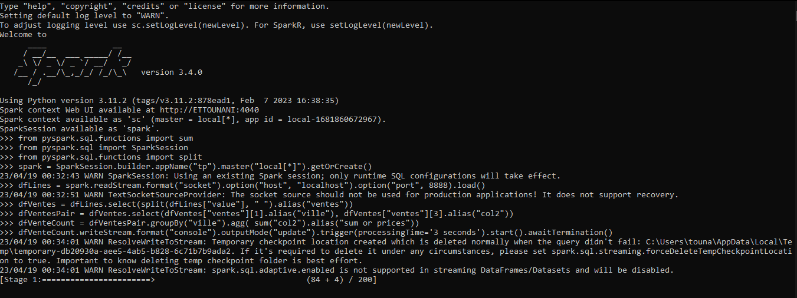

# PySpark

## Installation

### Install Java

```bash
sudo apt-get install default-jre
```

### Install Spark

```bash
wget http://apache.mirror.cdnetworks.com/spark/spark-2.4.0/spark-2.4.0-bin-hadoop2.7.tgz
tar -xvzf spark-2.4.0-bin-hadoop2.7.tgz
sudo mv spark-2.4.0-bin-hadoop2.7 /opt/spark
```

### Install PySpark

```bash
sudo pip install pyspark
```

## Run PySpark

```bash
pyspark
```

## Application Example

```python
from pyspark.sql import SparkSession
from pyspark.sql.functions import split

spark = SparkSession.builder.appName("tp").master("local[*]").getOrCreate()
dfLines = spark.readStream.format("socket").option(
    "host", "localhost").option("port", 8888).load()

# Split the lines using space as delimiter
dfVentes = dfLines.select(split(dfLines["value"], " ").alias("ventes"))

# Create a new dataframe with columns dfVentes[1] and dfVentes[3]
dfVentesPair = dfVentes.select(dfVentes["ventes"][1].alias(
    "ville"), dfVentes["ventes"][3].alias("col2"))


# Group by the first column and sum the values of column 2
dfVenteCount = dfVentesPair.groupBy("ville").agg(
    sum("col2").alias("sum or prices"))

dfVenteCount.writeStream.format("console").outputMode("update").trigger(
    processingTime='3 seconds').start().awaitTermination()

```

## Run Application

```bash
nc -lk 8888
```

### Input file

```bash
22/12/2020 casa pc7 34000
22/11/2021 safi pc5 3000
19/07/2022 zemamra pc4 6000
02/08/2022 tangier pc6 7000
12/09/2023 casa pc2 7000
23/11/2019 agadir pc3 8000
03/10/2018 casa pc1 9000
```

### Output

```bash
+-----+----------+
|ville|sum or prices|
+-----+----------+
| casa|     50000|
| safi|     3000|
| zemamra|     6000|
| tangier|     7000|
| agadir|     8000|

```

## Demo by photos





